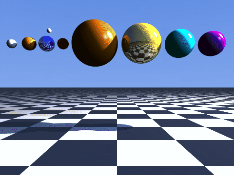
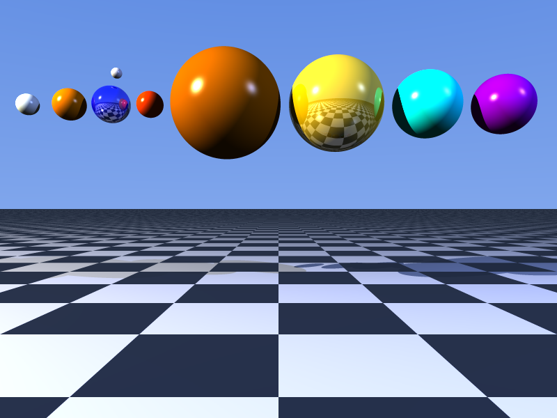
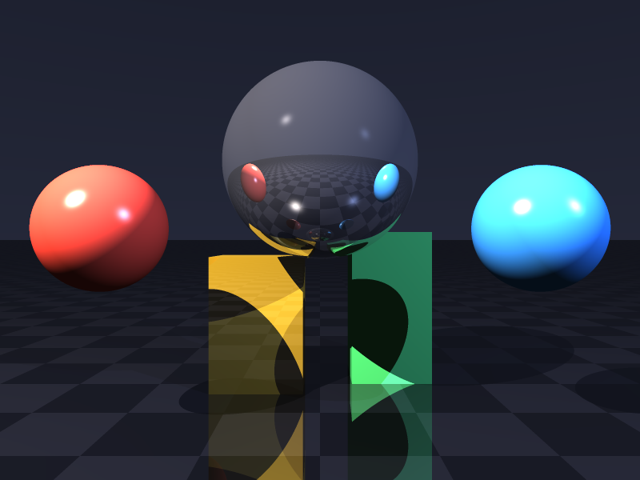
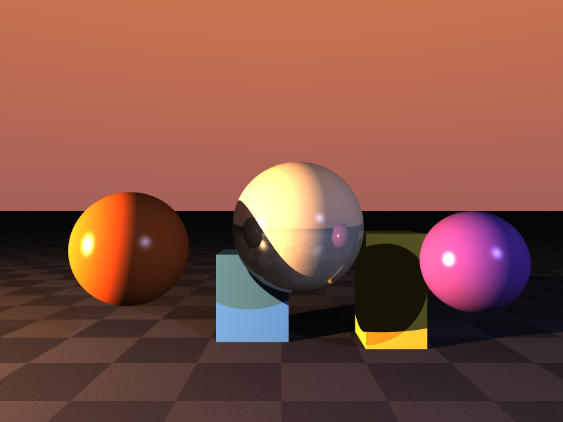

# Lumen

[](https://github.com/yib7/Lumen/actions/workflows/ci.yml)

A CPU raytracer written in C. It reads a plain-text scene file and renders it
to a PNG or PPM image with reflections, shadows, anti-aliasing, and multiple
material types. Rendering runs across all cores using OpenMP.



Every frame above is a real Lumen render. As the key light orbits the scene the
shadows swing across the floor, the specular highlights track it, and the
reflective spheres and checkered floor mirror their surroundings.

## What it does

Lumen casts a ray through every pixel, finds the nearest surface it hits, and
shades that point. From there it adds the features that separate a raytracer
from a flat rasterizer:

- Recursive reflections. Reflective surfaces spawn a new ray and blend the
  reflected color back in, up to a configurable bounce limit.
- Hard shadows. Each light is tested with a shadow ray, so objects occlude
  each other.
- Anti-aliasing by supersampling. Each pixel averages an NxN grid of rays,
  which removes the jagged edges a single ray per pixel leaves behind.
- Three primitives: spheres, infinite planes (with optional checkerboard), and
  axis-aligned boxes.
- Two material models: matte (ambient + diffuse + Phong specular) and
  reflective (the matte model blended with a mirror reflection).
- Multiple colored point lights with distance attenuation.
- A vertical sky gradient as the background.
- Multithreaded rendering with OpenMP, one image row per work unit.

The three scenes in `scenes/` produced the images in `renders/`.

| `solar.scene` | `mirrors.scene` | `sunset.scene` |
|---|---|---|
|  |  |  |

## Tech stack

C11, the C standard library, and OpenMP for parallelism. PNG encoding uses the
vendored public-domain `stb_image_write.h` (see `CREDITS.md`). No other
dependencies.

## Platform

Built and tested on Windows 11 with the WinLibs MinGW-w64 toolchain
(gcc 16.1.0, UCRT runtime). The code is portable C11 and should build on Linux
or macOS with any gcc or clang that supports OpenMP, but those have not been
tested here.

## Build

You need gcc with OpenMP support (MinGW-w64 on Windows, the system gcc/clang
elsewhere). From the repository root:

```sh
gcc -O2 -fopenmp -std=c11 -Isrc src/*.c -lm -o lumen
```

Or use one of the helpers, which run the same command:

```sh
./build.sh        # release build
make              # same, via Make (on WinLibs MinGW the command is mingw32-make)
```

If your compiler has no OpenMP, drop `-fopenmp`; the renderer falls back to a
single thread and prints "1 (single-threaded build)" at startup.

## Run

```sh
./lumen --scene scenes/solar.scene --output renders/solar.png
```

With no arguments it renders `scenes/solar.scene` to `out.png` at 800x600.

### Options

```
-s, --scene PATH     scene file to render (default: scenes/solar.scene)
-o, --output PATH    output image; .png or .ppm chosen by extension (default: out.png)
-w, --width N        image width in pixels (default: 800)
-h, --height N       image height in pixels (default: 600)
-a, --samples N      anti-aliasing grid; N*N rays per pixel (default: 2)
-d, --depth N        reflection bounce limit (default: 4)
-t, --threads N      worker threads, 0 = auto (default: 0)
    --help           show this message
```

Example with heavier anti-aliasing and a larger frame:

```sh
./lumen -s scenes/mirrors.scene -o renders/mirrors.png -w 1280 -h 960 -a 4 -d 6
```

## Performance

Rendering is the bottleneck, and it parallelizes cleanly because image rows are
independent. On a 12-thread CPU, rendering `scenes/mirrors.scene` at 1200x900
with 3x3 anti-aliasing and depth 8 drops from about 3.7s single-threaded to
about 0.50s across all cores: roughly a 7.4x speedup. It is sub-linear, not
12x, because the reflective scene makes some rays recurse far deeper than others
(dynamic scheduling balances that) and the cores share memory bandwidth. Run
your own with `-t 1` versus `-t 0`.

## Tests

`tests/smoke.sh` builds the renderer and renders every bundled scene at a small
size, checking each output is a valid PNG. It runs on every push through GitHub
Actions (see the badge above).

```sh
bash tests/smoke.sh
```

## Viewing the output

PNG files open in any image viewer or browser. PPM is a raw uncompressed
format; many viewers (IrfanView, GIMP, the macOS/Linux `feh` and ImageMagick
`display`) read it directly, or you can convert it with
`magick out.ppm out.png`. PNG is the default because it needs no extra tools.

## Scene files

A scene is a text file, one directive per line, with `#` starting a comment.
Coordinates use a left-handed system: the camera sits at the origin looking
down +z, +y is up, +x is right.

```
# directive  parameters
camera   px py pz  fov
sky      topR topG topB   botR botG botB
light    x y z   r g b   intensity
sphere   cx cy cz  radius   r g b            [reflect reflectivity shininess]
plane    nx ny nz  dist   r1 g1 b1  r2 g2 b2 [reflect reflectivity shininess]
box      minx miny minz  maxx maxy maxz  r g b [reflect reflectivity shininess]
```

Planes are drawn as a checkerboard of the two colors. The optional
`reflect reflectivity shininess` suffix on any object switches it to the
reflective material; `reflectivity` is the 0..1 mirror blend and `shininess`
is the specular exponent. The parser reports the line number and the problem
on malformed input, for example `line 7: 'abc' is not a number`.

See `scenes/solar.scene` for a fully commented example.

## Project layout

```
src/            renderer source (see docs/ARCHITECTURE.md)
scenes/         scene description files
renders/        sample output committed for the README
third_party/    vendored stb_image_write.h
docs/           architecture notes
build.sh        build helper
Makefile        same build via Make
```

## License

MIT, see `LICENSE`. Third-party attribution is in `CREDITS.md`.
