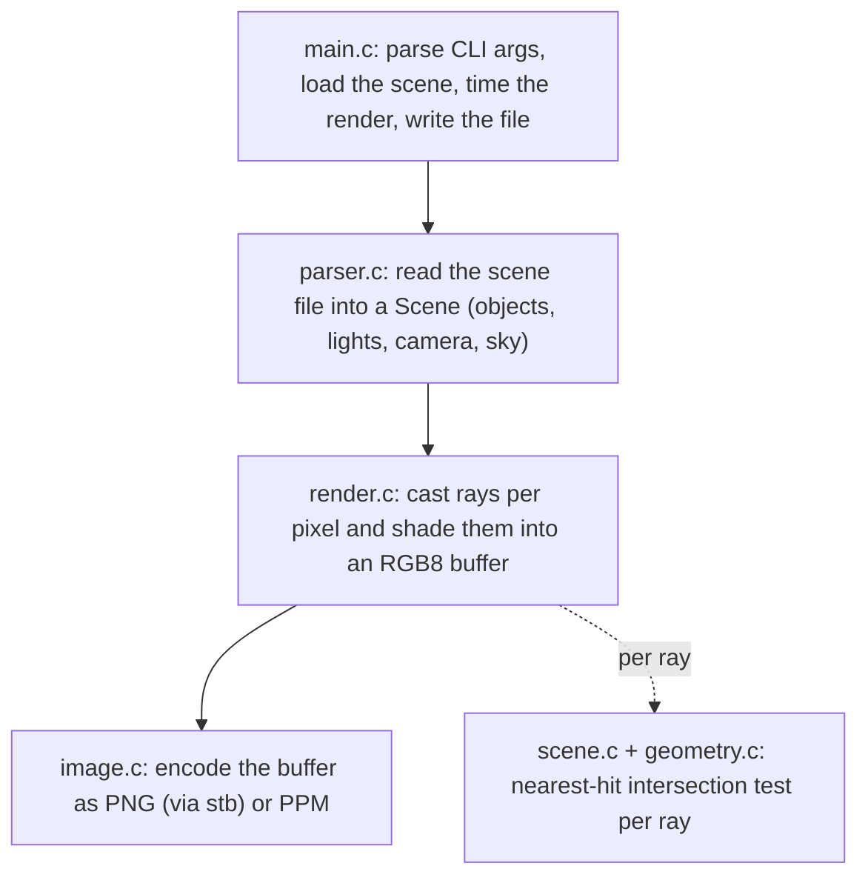

# Architecture

Lumen is a Whitted-style recursive raytracer. This document walks through how
a render happens and how the source is organized, so a newcomer can find their
way around in a few minutes.

## The render pipeline

For each pixel the renderer builds one or more primary rays from the camera
through the image plane, calls `trace`, and averages the results. `trace` does
the core work:

1. Find the nearest object the ray hits (`scene_intersect`).
2. If nothing is hit, return the sky gradient color for that ray direction.
3. Otherwise shade the hit point locally (`shade_local`): ambient term, then
   for each light a diffuse and specular contribution, skipping lights that a
   shadow ray finds occluded.
4. If the surface is reflective and the recursion budget is not spent, cast a
   reflection ray, trace it, and blend the result in by the material's
   reflectivity.

The recursion in step 4 is what makes mirrored surfaces show their
surroundings, and why raising `--depth` changes scenes with reflective objects
that face each other.

Shading runs in linear light and yields floating-point color; `render.c` then
quantizes each channel to 8 bits for the buffer. With `--gamma` it first applies
an sRGB-ish `pow(1/2.2)` encoding. That flag is off by default so the bundled
scenes keep the linear tuning their attenuation constants were set against.

## Coordinate system and camera

A left-handed system: by default the camera looks down +z, +y is up, +x is
right. The image plane sits at z = 1. `Camera.fov_scale` is the half-height of
that plane, so a larger value widens the field of view. The horizontal extent is
scaled by the image aspect ratio so pixels stay square at any resolution.

A scene can instead give the camera a look-at target. When it does, `render_scene`
builds an orthonormal basis (forward, right, up) from the camera position and
target once per render and forms rays in that basis; with no target the basis is
exactly +x/+y/+z, so the default path is unchanged.

## Modules

| File | Responsibility |
|------|----------------|
| `vec3.{c,h}` | 3D vector math. Positions, directions, normals, and colors are all `Vec3`. Small by-value helpers that inline under `-O2`. |
| `scene.{c,h}` | Core data types (`Ray`, `Material`, `Object`, `Light`, `Camera`, `Scene`, `Hit`), the object list, and `scene_intersect`, which loops objects and keeps the closest hit. |
| `geometry.{c,h}` | Ray/primitive intersection math for sphere, plane, and box. Each test returns the hit distance, point, and outward normal. |
| `render.{c,h}` | Shading, shadows, reflections, anti-aliasing, and the OpenMP-parallel pixel loop. Produces the RGB8 buffer. |
| `parser.{c,h}` | Tokenizes the scene file line by line and builds the `Scene`, with line-numbered error messages. |
| `image.{c,h}` | Writes the buffer to disk, choosing PNG or PPM by file extension. |
| `main.c` | CLI parsing, orchestration, timing, and process exit codes. |

Rendering is decoupled from `main`. `render_scene` takes a `Scene` and a
`RenderConfig` and returns a pixel buffer, so it can be driven from anywhere,
not only the command line.

## Materials

Two material kinds live in `Material.kind`:

- `MAT_DIFFUSE`: ambient + Lambertian diffuse + a Phong specular highlight.
- `MAT_REFLECTIVE`: the diffuse result blended toward a traced reflection ray
  by `reflectivity`.

Planes carry a second color and a `checker` flag; when set, the albedo is
chosen per point from a 3D checkerboard parity test on the floored
coordinates.

## Parallelism

Image rows are independent, so the outer loop in `render_scene` carries an
`#pragma omp parallel for` with dynamic scheduling. Dynamic scheduling matters
because pixels covering reflective objects cost more (they recurse), so static
chunks would leave some threads idle. The whole renderer is read-only on the
`Scene` during the render, which is why no locking is needed. Build without
`-fopenmp` and the same loop runs serially.

An atomic counter tracks completed rows as the threads finish them. When stderr
is an interactive terminal the master thread prints a live `row N/total` line so
a long render is not a silent wait; redirected or piped stderr stays quiet, and
the counter adds no measurable cost.

## Performance notes

- Ray direction is normalized once per primary ray, so the sphere quadratic
  uses `a = 1` and skips a multiply.
- Intersection is a linear scan over the object list. That is fine for scenes
  of tens of objects. A spatial acceleration structure (BVH) would be the next
  step for thousands of objects and is the obvious extension point in
  `scene_intersect`.
- An epsilon (`1e-4`) is added to the start distance of shadow and reflection
  rays so a surface does not shadow or reflect itself from rounding error.
- Shadow rays use an any-hit query (`scene_intersect_any`) that returns on the
  first blocker between the point and the light, rather than the full
  closest-hit scan `trace` uses. Shadow rays are the most numerous, so stopping
  early matters.

## Testing and CI

Four entry points cover the code:

- `tests/unit_geometry.c` is a standalone C program that asserts the
  intersection math directly (for example a box's exit-face normal). It is
  compiled and run by `validate.sh`.
- `tests/validate.sh` builds the unit test and drives the binary: it checks the
  CLI rejects and caps bad arguments, the parser rejects malformed and
  out-of-range scenes with line-numbered errors, a scene renders to an exact PPM
  byte size, and a small `solar.scene` render matches a committed golden hash and
  named pixel values (so a shading, checker, reflection, or sky regression is
  caught, not just a size change).
- `tests/smoke.sh` renders every bundled scene at a small size and checks each
  output is a valid PNG.
- `tests/sanitize.sh` rebuilds with AddressSanitizer and UndefinedBehaviorSanitizer
  and runs the parser over the bundled, coincident-light, and malformed scenes,
  failing on any sanitizer diagnostic. It skips cleanly where the sanitizer
  runtimes are absent (the WinLibs MinGW toolchain has none), so it runs for real
  in CI.

`.github/workflows/ci.yml` runs all three shell suites on Ubuntu on every push
and pull request, compiling with `-Werror`. The CI badge in the README links to
that run.

## Extending it

- New primitive: add a kind to `ObjectKind`, a struct to the `Object` union,
  an `intersect_*` function in `geometry.c`, and a case in `object_intersect`
  (scene.c) and the parser.
- New material: add to `MaterialKind` and handle it in `trace`/`shade_local`.
- New light type: extend `Light` and the loop in `shade_local`.
